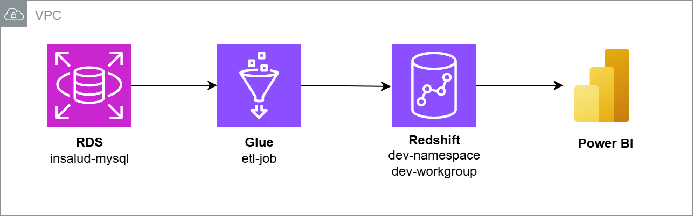
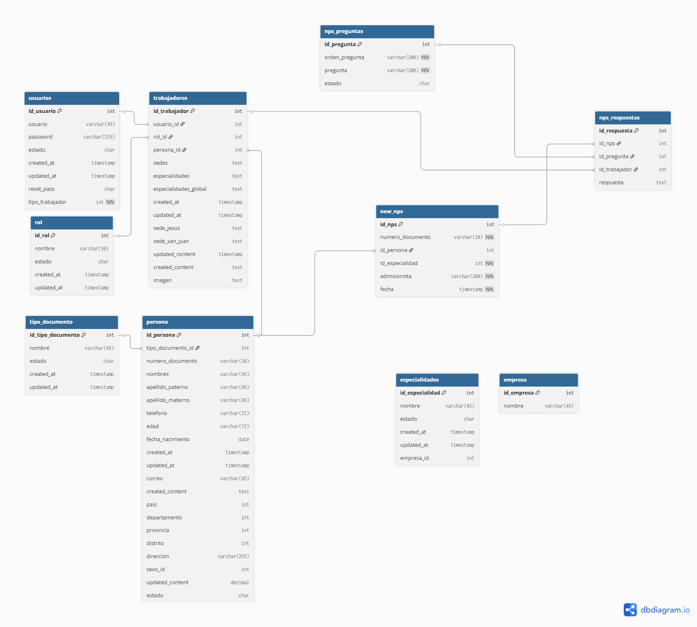
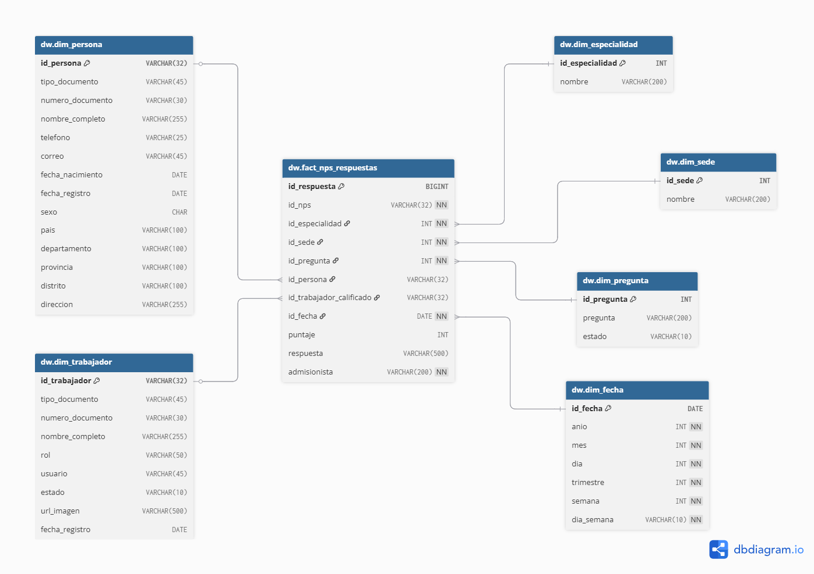

# 🏥 Documentación del Data Mart de Redshift – Encuestas NPS Insalud

### 🎯 Requerimiento
Consolidar todos los esquemas en un **Data Warehouse en Amazon Redshift**, utilizando una técnica de modelado tipo **Galaxy Schema**.

La **primera fase (MVP)** se enfoca en el **análisis de encuestas NPS**, considerando:
- 1 tabla de hechos
- 6 tablas de dimensiones

La fuente de datos es **Amazon RDS**, y los procesos **ETL (Extract, Transform, Load)** extraen, transforman y cargan la información hacia **Amazon Redshift**.

#### Arquitectura propuesta

---

## 1. Descripción de la fuente de datos

**Insalud** cuenta con una instancia de **Amazon RDS** que aloja **7 esquemas** (uno por sede):

| Esquema | Ubicación | Descripción |
|----------|------------|-------------|
| `sistema_insalud` | Jesús María, Lima, Perú | Sede principal |
| `sistema_insalud_sur` | San Juan de Miraflores, Lima, Perú | Sede Sur |
| `sistema_insalud_golf` | Surco, Lima, Perú | Sede El Golf |
| `sistema_insalud_guayaquil` | Guayaquil, Ecuador | Sede Ecuador 1 |
| `sistema_insalud_quito` | Quito, Ecuador | Sede Ecuador 2 |
| `sistema_insalud_panama` | Panamá | Solo gestiona encuestas NPS |
| `sistema_insalud_centralizado` | Global | Tablas maestras y catálogos comunes |

Cada esquema contiene aproximadamente **100 tablas**, con ligeras variaciones entre sedes.

---

### Encuestas NPS

**Insalud** almacena información de encuestas **NPS (Net Promoter Score)** para analizar la fidelidad y satisfacción de sus pacientes.

#### Tablas actuales (en Amazon RDS)

Cada esquema de la instancia (como `sistema_insalud`, `sistema_insalud_sur`, `sistema_insalud_golf`, etc.) contiene las siguientes tablas:

- **`new_nps`**  
  Contiene los registros actuales de encuestas NPS. Los primeros registros aparecen desde **agosto de 2025**, según el esquema.

- **`nps_preguntas`**  
  Almacena las preguntas de las encuestas.  
  *(Sin columna de fecha)*

- **`nps_respuestas`**  
  Almacena las respuestas de las encuestas.  
  *(Sin columna de fecha)*

---

#### Tablas anteriores (solo en `sistema_insalud`)

Antes de la migración, toda la información de todas las sedes se almacenaba únicamente en el esquema `sistema_insalud`:

- **`nps`**  
  *(Sin columna de fecha)*

- **`detalle_nps`**  
  - Primer registro: 2024-08-14  
  - Último registro: 2025-08-21  

- **`preguntas`**  
  *(Sin columna de fecha)*

- **`respuestas`**  
  *(Sin columna de fecha)*

---

#### Tablas posiblemente usadas para pruebas (`sistema_insalud`)

- **`nps_des`** — *(Sin columna de fecha)*  
- **`detalle_nps_des`** — Registros entre 2024-09-04 y 2024-09-04  
- **`respuestas_des`** — *(Sin columna de fecha)*  
- **`respuestas_backup`** — Registros entre 2024-05-31 y 2024-08-13  
- **`respuestas_nps`** — Registros entre 2024-08-14 y 2024-09-04  

---

#### Modelo actual en Amazon RDS

---

## 2. Casos de uso

- 🔍 **Acelerar** la recuperación y consulta de datos.  
- 🧩 **Simplificar** la redacción de consultas SQL complejas.  
- 📊 **Facilitar** la generación de reportes y dashboards analíticos.  
- 🔁 **Centralizar** la información de múltiples sedes en un modelo unificado.

---

## 3. Granularidad

La **granularidad** define el nivel más bajo de detalle dentro de una tabla de hechos.

| Tabla de hechos | Granularidad |
|------------------|--------------|
| `fact_nps_respuestas` | Cada fila representa una **respuesta individual** a una pregunta específica dentro de una encuesta NPS. |

---

## 4. Diseño del modelo de datos

### 🧮 Tabla de hechos
- `fact_nps_respuestas`

### 🧱 Tablas de dimensiones
- `dim_persona`
- `dim_trabajador`
- `dim_sede`
- `dim_especialidades`
- `dim_pregunta`
- `dim_fecha`

#### Esquema estrella propuesto

---

## 5. Procesos ETL / ELT

El proyecto utiliza **ETL jobs incrementales** con la siguiente lógica:

1. **Extracción:** Lectura directa desde RDS.  
2. **Transformación:** Uso de **Spark SQL** para consolidar, limpiar y validar los datos.  
   - Las transformaciones se definen en archivos `.sql` almacenados en S3.  
3. **Carga:** Inserción de los resultados directamente en Amazon Redshift.

#### Ejemplo – Carga de la dimensión `dim_persona`
- Se combinan todas las tablas `persona` de los distintos esquemas.  
- Si una persona aparece en varias sedes (mismo número de documento), se conserva **solo el registro más reciente**.  
- Se aplica limpieza y validación de datos antes de la carga final.

---

### ETL Jobs

| Job | Descripción |
|------|--------------|
| `env-nps-respuestas-etl` | Pobla la tabla de hechos `fact_nps_respuestas` con respuestas NPS nuevas. |
| `env-old-nps-etl` | Pobla la tabla de hechos `fact_nps_respuestas` con respuestas NPS de esquemas anteriores. |
| `env-personas-etl` | Pobla la tabla de dimensión `dim_persona`. |
| `env-trabajadores-etl` | Pobla la tabla de dimensión `dim_trabajador`. |

Las tablas de dimensiones restantes fueron pobladas directamente desde **Query Editor V2** de Redshift mediante sentencias `INSERT INTO`.

---

#### Próximos pasos en evaluación

- Registrar las tablas en un **Catálogo de Glue** mediante **Crawlers**.  
- Crear una **zona de staging en S3** para almacenamiento intermedio.  
- Implementar un **pipeline automatizado** con jobs separados:  
  - Uno para **dimensiones**.  
  - Otro para **hechos**.  

---

## 6. Slowly Changing Dimensions (SCD)

Las **dimensiones pueden variar con el tiempo**, por lo que se debe definir la estrategia de actualización (tipo 1, 2 o 3) según el caso.

| Tabla | Frecuencia de cambio | Observaciones |
|--------|----------------------|----------------|
| `fact_nps_respuestas` | ~100 registros nuevos/día | Respuestas recientes |
| `dim_persona` | ~50 nuevos registros/día | Cambios frecuentes |
| `dim_trabajador` | 1–2 nuevos registros/día | Cambios ocasionales |
| `dim_sede` | Muy baja | Estructura casi estática |
| `dim_especialidades` | Muy baja | Se actualiza manualmente |
| `dim_pregunta` | Muy baja | Cambios al rediseñar encuestas |
| `dim_fecha` | Ninguno | Precargada y estática |

> ⚙️ **Pendiente:** definir la frecuencia óptima y el orden de ejecución de los ETL jobs.

---

## 7. Referencias

1. [IBM – Step to Identify the Grain](https://www.ibm.com/docs/en/ida/9.1.1?topic=phase-step-identify-grain)  
2. [AWS – Hybrid Approach in Healthcare Data Warehousing with Redshift](https://aws.amazon.com/es/blogs/big-data/a-hybrid-approach-in-healthcare-data-warehousing-with-amazon-redshift/)  
3. [Microsoft Power BI – Star Schema Design Guidance](https://learn.microsoft.com/es-es/power-bi/guidance/star-schema)

---

📘 **Última actualización:** Octubre 2025  
✍️ **Autor:** Luis Méndez – Practicante de Data Science, Insalud

